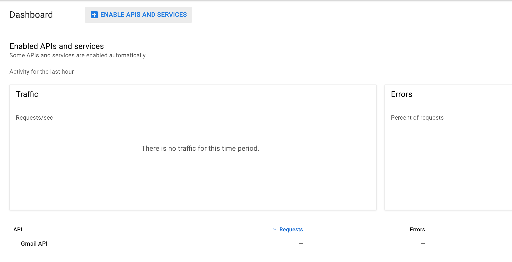
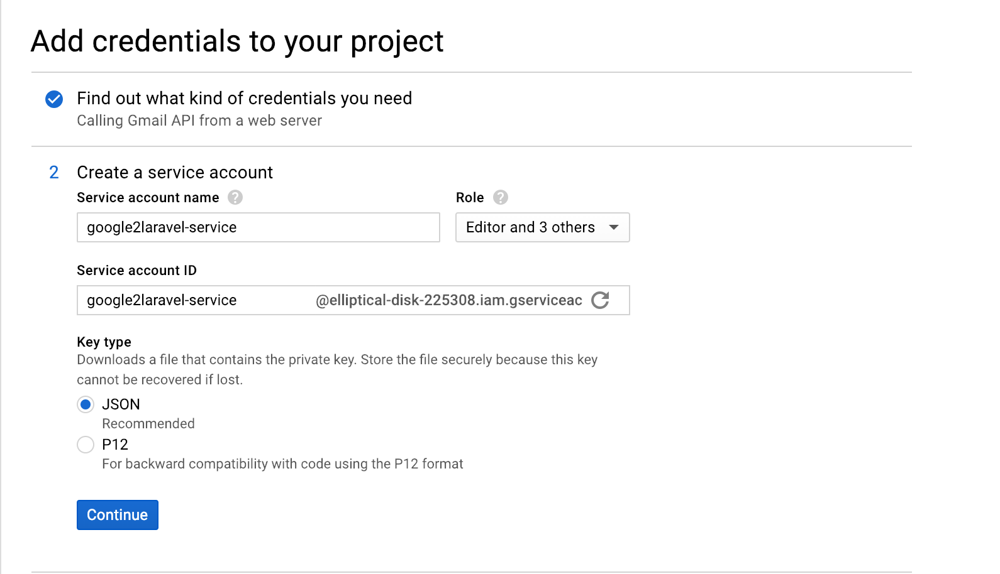

# Google2Laravel

[![Latest Version on Packagist][ico-version]][link-packagist]
[](license.md)
[![Total Downloads][ico-downloads]][link-downloads]
[![Build Status][ico-travis]][link-travis]

A Laravel package to help manage multiple Gmail Clients on the same platform. 

This package is build on version 2.0 of the Official google/apiclient package.

**Table of Contents**  

- [Installation](#installation)
- [Usage](#usage)
  - [Requirements](#requirements)
  - [Instantiating a Google Client Object with multiple Gmail clients](#instantiating-a-google-client-object-with-multiple-gmail-clients)
  - [Calling a method](#calling-a-method)
  - [The full list of methods](#the-full-list-of-methods)
- [Setup](#setup)
    - [Google Developer project](#google-developer-project)
    - [Service account client](#service-account-client)
    - [Roles and Permissions](#roles-and-permissions)
- [Quotas](#quotas)
- [Exceptions and errors](#exceptions-and-errors)
- [Changelog](#changelog)
- [Testing](#testing)
- [Contributing](#contributing)
- [Security](#security)
- [Credits](#credits)
- [License](#license)

## Installation

You can use Composer or simply Download the Release

``` bash
$ composer require flyhjaelp/gmail2laravel
```

## Usage

## Requirements
- [ PHP 7.1.3 or higher](http://www.php.net/)
- [ Google/apiclient ]( https://github.com/googleapis/google-api-php-client )

## Instantiating a Google Client Object with multiple Gmail clients

``` php
$credentialsPath = "path/to/credentials/file.json";

$googleClient    =  new gmail2laravel($credentials);

$gmailClient     =  $googleClient->getGmailClient('your.email@domain.com');
```

## Calling a method

``` php
// get an email
$emails = $gmailClient->user_messages->get('your.email@domain.com',$messageId);

// fetching all labels
$labels =  $gmailClient->user_labels->listUsersLabels('me');
```

## List of methods
``` php
$googleClient  =  new gmail2laravel($credentials);

$googleClient()->getGmailClient($email)

$googleClient()->deleteGmailClient($email)

$googleClient()->getEmailsFromAllClients($email)

$googleClient()->availableClients($email)

$googleClient()->enableBatch($email)

$googleClient()->disableBatch($email)
```

## Additional list of methods

These methods are being imported from the main Google Gmail Api Package, and can be called as explained in the  Gmail API documentation, where a broader description of the parameters required and the response is being provided. Link are provided bellow to each resource.

- [Users](https://developers.google.com/gmail/api/v1/reference/users)
- [Drafts](https://developers.google.com/gmail/api/v1/reference/users/drafts)
- [History](https://developers.google.com/gmail/api/v1/reference/users/history)
- [Labels](https://developers.google.com/gmail/api/v1/reference/users/labels)
- [Messages](https://developers.google.com/gmail/api/v1/reference/users/messages)
- [Messages attachments](https://developers.google.com/gmail/api/v1/reference/users/messages/attachments)
- [Settings  ](https://developers.google.com/gmail/api/v1/reference/users/settings)
- [Threads ](https://developers.google.com/gmail/api/v1/reference/users/threads)

## Setup

## Google Developer project

The package makes usage of the Google API library. To gain access to the emails, a Google Cloud Project has to be created.
A guide on how to do that can be found on the Google SDK platform [ Link ](https://developers.google.com/assistant/sdk/guides/library/python/embed/config-dev-project-and-account)

_Note_: the domain extension is important, as you will be able to access emails only from that domain. 
When creating a new Gmail Client instance, a check will be done automatically if the supplied user email address exists inside the g suite domain.

## Service account client

After creating a new project, add **Gmail API** from the API Library and enable it on the project. After that, you need to assign it a **Service account client**, which you can create from the Google Console meu.


 
**_Note_** : the service is available only for G-Suite users. 




After you generate a Service user, assign it to the project and provide it the wanted access rights. Its important to add it to the project and not to the Gmail Api, so you have access to other apis included in the project. 

Its best practices to separate APIs into separate projects if they are not related in usage. 
 
Keep in mind that you can have multiple services that are assigned to different tasks. 
You are limited to 100 services per project. The project limit is connected to the quota usage of each project. The quota usage is explained here: [ Quotas ](#Quotas)

## Roles and Permissions

To access Gmail Resources through a Service account client, you need to assign roles and permission to it. Depending to what the purpose of the project is, you need to add the required
permissions. An example   


## Quotas

For every Developer Project that usage the Gmail API, there is a quota usage measured by the Google servers. A list of the quota price can be found  [ here](https://developers.google.com/gmail/api/v1/reference/quota).

Keep in mind , each type of request is calculated a different amount of quota. This quotas are being added to the _quota units per day_ (1.000.000 default)

and the  _**quota_units_per_user_per_second**_ ( 250 default).


## Exceptions and errors

*Mention* : keep in mind that these exceptions are being thrown by the Google API endpoints, and not by this package. The google project is a very strict environment
and rules which may not be imediately obvious may take place. The official documentation provides answer to some of the best practices on how to manage and access the respu

**Domain wide delegation (DWD)**

``` php
Google_Service_Exception: {
  "error": "unauthorized_client",
  "error_description": "Client is unauthorized to retrieve access tokens using this method."
}
```
This is a common error when running an API call with a service account but not properly completing the domain-wide delegation (DWD) or because the authorization in the admin console has not propagated yet.

This [article](https://developers.google.com/admin-sdk/directory/v1/guides/delegation) explains in details the process of DWD.

**Domain wide delegation (DWD)**

``` php
Google_Service_Exception: {
 "error": {
  "errors": [
   {
    "domain": "global",
    "reason": "forbidden",
    "message": "Delegation denied for your.email@domain.com"
   }
  ],
  "code": 403,
  "message": "Delegation denied for your.email@domain.com"
 }
}
```
This error happens when the Gmail Client is setup for a specific email address and then the method call is being provided in the arguments with a different user id/email. 
You need to manage in the call which GmailClient to use and provide as the user id the value of 'me', and the code will take the associated email in return.
Example.

``` php
//direct call with direct return from the google client
$googleClient->$gmailClient('dave@gmail.com')->users_labels->listUsersLabels('me');
```

**Message not found**
``` php
Google_Service_Exception: {
 "error": {
  "errors": [
   {
    "domain": "global",
    "reason": "notFound",
    "message": "Not Found"
   }
  ],
  "code": 404,
  "message": "Not Found"
 }
}
```
The message you are trying to fetch is no longer available on the email address, due to maybe permanent deletion or wrong message id. Keep in mind that in some cases, the _message id_ is the same as the _thread id_


**Quota limit reached**
``` php
Google_Service_Exception: {
 "error": "rate_limit_exceeded"
}
```
Exceeding a rate limit will cause an HTTP _403_ or _HTTP 429 Too Many Requests_ response and your app should respond by retrying with exponential backoff.
[Link](https://developers.google.com/gmail/api/guides/performance) to best practices guides to avoid exceeding the limits and how much quota each type of request uses [link](https://developers.google.com/gmail/api/v1/reference/quota).

## Changelog

Please see the [changelog](changelog.md) for more information on what has changed recently.

## Testing

``` bash
$ composer test
```


## Contributing

Please see [contributing.md](contributing.md) for details and a todo list.

## Security

If you discover any security related issues, please email [author email] instead of using the issue tracker.

_Note_: Its your responsibility to ensure the storage of the service credentials key. Do not publish them on your repo, and the path to the key, should never be stored directly.

## Credits

- [Dan Traian Roman](https://github.com/dantraian)
- [All Contributors][link-contributors]

## License

The MIT License (MIT). Please see [License File](license.md) for more information.

[ico-version]: https://img.shields.io/packagist/v/flyhjaelp/gmail2laravel.svg?style=flat-square
[ico-downloads]: https://img.shields.io/packagist/dt/flyhjaelp/gmail2laravel.svg?style=flat-square
[ico-travis]: https://img.shields.io/travis/flyhjaelp/gmail2laravel/master.svg?style=flat-square
[ico-styleci]: https://styleci.io/repos/12345678/shield

[link-packagist]: https://packagist.org/packages/flyhjaelp/gmail2laravel
[link-downloads]: https://packagist.org/packages/flyhjaelp/gmail2laravel
[link-travis]: https://travis-ci.org/flyhjaelp/gmail2laravel
[link-styleci]: https://styleci.io/repos/12345678
[link-author]: https://github.com/flyhjaelp
[link-contributors]: ../../contributors]
[author email]: dtr@flyhjaelp.dk